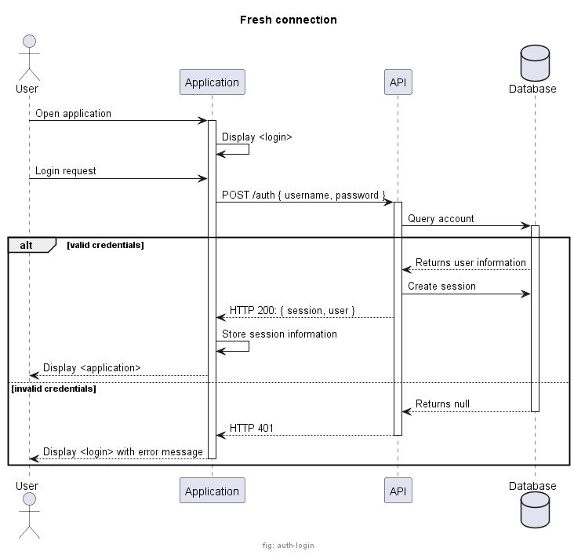
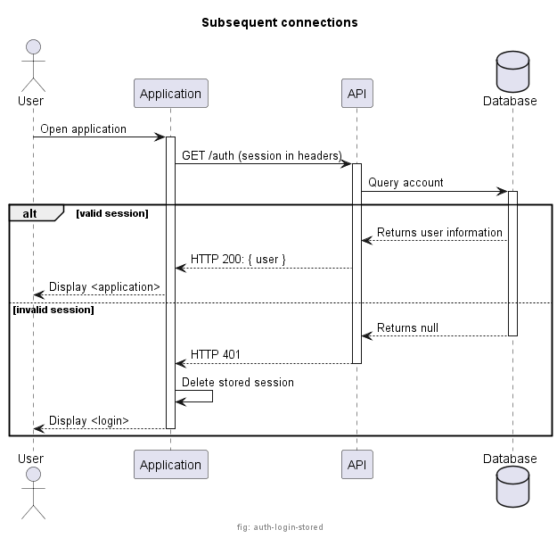
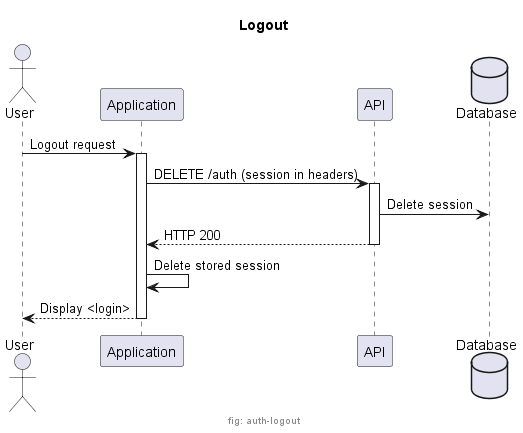

# alpha-auth-common

## Content

This project contains generated model and service based on the OpenAPI definition.

## Ecosystem

| Repository   | Description |
| ----------   | ----------- |
| [alpha-auth](https://github.com/ash-uncover/alpha-auth) | React frontend. |
| [alpha-auth-api](https://github.com/ash-uncover/alpha-auth-api) | Express web service providing REST API. |
| **[alpha-auth-common](https://github.com/ash-uncover/alpha-auth-common)** | **Typescript models and service definition (consumed in frontend and API).** |
| [alpha-auth-db](https://github.com/ash-uncover/alpha-auth-db) | Convenient projet for starting local database. |

## Features

### Authentication

#### Fresh connection

<!--
@startuml ./resources/help/auth-login

footer "fig: auth-login"

title Fresh connection

actor User as user
participant "Application" as UI
participant "API" as API
database "Database" as DB

user -> UI: Open application
activate UI
UI -> UI: Display <login>
user -> UI: Login request
UI -> API: POST /auth { username, password }
activate API
API -> DB: Query account
activate DB
alt valid credentials
  API <-- DB: Returns user information
  API -> DB: Create session
  UI <-- API: HTTP 200: { session, user }
  UI -> UI: Store session information
  user <-- UI: Display <application>
else invalid credentials
  API <-- DB: Returns null
  deactivate DB
  UI <-- API: HTTP 401
  deactivate API
  user <-- UI: Display <login> with error message
  deactivate UI
end

@enduml
-->

#### Subsequent connections

<!--
@startuml ./resources/help/auth-login-stored

footer "fig: auth-login-stored"

title Subsequent connections

actor User as user
participant "Application" as UI
participant "API" as API
database "Database" as DB

user -> UI: Open application
activate UI
UI -> API: GET /auth (session in headers)
activate API
API -> DB: Query account
activate DB
alt valid session
  API <-- DB: Returns user information
  UI <-- API: HTTP 200: { user }
  user <-- UI: Display <application>
else invalid session
  API <-- DB: Returns null
  deactivate DB
  UI <-- API: HTTP 401
  deactivate API
  UI -> UI: Delete stored session
  user <-- UI: Display <login>
  deactivate UI
end

@enduml
-->

#### Logout

<!--
@startuml ./resources/help/auth-logout

footer "fig: auth-logout"

title Logout

actor User as user
participant "Application" as UI
participant "API" as API
database "Database" as DB

user -> UI: Logout request
activate UI
UI -> API: DELETE /auth (session in headers)
activate API
API -> DB: Delete session
UI <-- API: HTTP 200
deactivate API
UI -> UI: Delete stored session
user <-- UI: Display <login>
deactivate UI

@enduml
-->

### Registration

### Recovery
