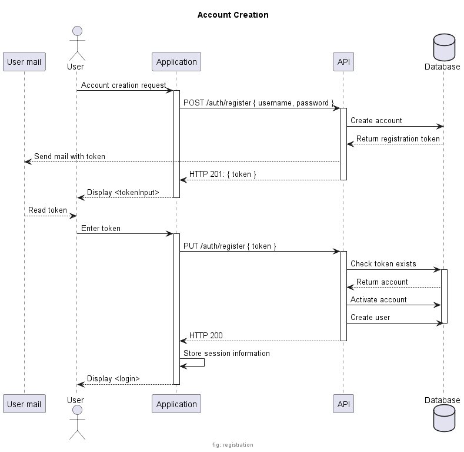
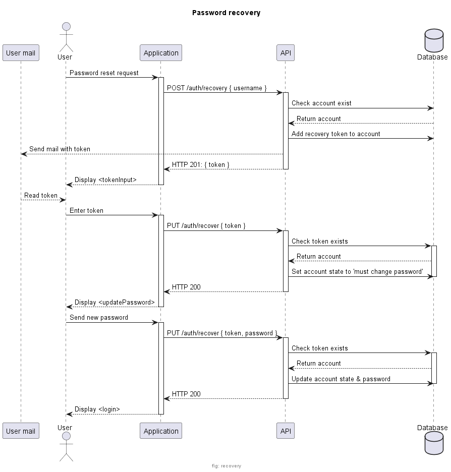

# alpha-auth-common

## Content

This project contains generated model and service based on the OpenAPI definition.

## Ecosystem

| Repository   | Description |
| ----------   | ----------- |
| [alpha-auth](https://github.com/ash-uncover/alpha-auth) | React frontend. |
| [alpha-auth-api](https://github.com/ash-uncover/alpha-auth-api) | Express web service providing REST API. |
| **[alpha-auth-common](https://github.com/ash-uncover/alpha-auth-common)** | **Typescript models and service definition (consumed in frontend and API).** |
| [alpha-auth-db](https://github.com/ash-uncover/alpha-auth-db) | Convenient projet for starting local database. |

## Features

The following workflows are made available by the alpha-auth project:

- [Authentication](https://github.com/ash-uncover/alpha-auth-common#authentication)
  - [First Connection](https://github.com/ash-uncover/alpha-auth-common#fresh-connection)
  - [Next Connections](https://github.com/ash-uncover/alpha-auth-common#subsequent-connections)
  - [Logout](https://github.com/ash-uncover/alpha-auth-common#logout)
- [Registration](https://github.com/ash-uncover/alpha-auth-common#registration)
- [Password Recovery](https://github.com/ash-uncover/alpha-auth-common#password-recovery)
- [Change Mail](https://github.com/ash-uncover/alpha-auth-common#change-mail)

### Authentication

#### Fresh connection

<!--
@startuml ./resources/help/auth-login

footer "fig: auth-login"

title Fresh connection

actor User as user
participant "Application" as UI
participant "API" as API
database "Database" as DB

user -> UI: Open application
activate UI
UI -> UI: Display <login>
user -> UI: Login request
UI -> API: POST /auth { username, password }
activate API
API -> DB: Query account
activate DB
alt valid credentials
  API <-- DB: Returns user information
  API -> DB: Create session
  UI <-- API: HTTP 200: { session, user }
  UI -> UI: Store session information
  user <-- UI: Display <application>
else invalid credentials
  API <-- DB: Returns null
  deactivate DB
  UI <-- API: HTTP 401
  deactivate API
  user <-- UI: Display <login> with error message
  deactivate UI
end

@enduml
-->

#### Subsequent connections

<!--
@startuml ./resources/help/auth-login-stored

footer "fig: auth-login-stored"

title Subsequent connections

actor User as user
participant "Application" as UI
participant "API" as API
database "Database" as DB

user -> UI: Open application
activate UI
UI -> API: GET /auth (session in headers)
activate API
API -> DB: Query account
activate DB
alt valid session
  API <-- DB: Returns user information
  UI <-- API: HTTP 200: { user }
  user <-- UI: Display <application>
else invalid session
  API <-- DB: Returns null
  deactivate DB
  UI <-- API: HTTP 401
  deactivate API
  UI -> UI: Delete stored session
  user <-- UI: Display <login>
  deactivate UI
end

@enduml
-->

#### Logout

<!--
@startuml ./resources/help/auth-logout

footer "fig: auth-logout"

title Logout

actor User as user
participant "Application" as UI
participant "API" as API
database "Database" as DB

user -> UI: Logout request
activate UI
UI -> API: DELETE /auth (session in headers)
activate API
API -> DB: Delete session
UI <-- API: HTTP 200
deactivate API
UI -> UI: Delete stored session
user <-- UI: Display <login>
deactivate UI

@enduml
-->

### Registration

<!--
@startuml ./resources/help/registration

footer "fig: registration"

title Account Creation

participant "User mail" as mail
actor User as user
participant "Application" as UI
participant "API" as API
database "Database" as DB

user -> UI: Account creation request
activate UI
UI -> API: POST /auth/register { username, password }
activate API
API -> DB: Create account
API <-- DB: Return registration token
mail <-- API: Send mail with token
UI <-- API: HTTP 201: { token }
deactivate API
user <-- UI: Display <tokenInput>
deactivate UI
user <-- mail: Read token
user -> UI: Enter token
activate UI
UI -> API: PUT /auth/register { token }
activate API
API -> DB: Check token exists
activate DB
API <-- DB: Return account
API -> DB: Activate account
API -> DB: Create user
deactivate DB
UI <-- API: HTTP 200
deactivate API
UI -> UI: Store session information
user <-- UI: Display <login>
deactivate UI

@enduml
-->

### Password Recovery

<!--
@startuml ./resources/help/recovery

footer "fig: recovery"

title Password recovery

participant "User mail" as mail
actor User as user
participant "Application" as UI
participant "API" as API
database "Database" as DB

user -> UI: Password reset request
activate UI
UI -> API: POST /auth/recovery { username }
activate API
API -> DB: Check account exist
API <-- DB: Return account
API -> DB: Add recovery token to account
mail <-- API: Send mail with token
UI <-- API: HTTP 201: { token }
deactivate API
user <-- UI: Display <tokenInput>
deactivate UI
user <-- mail: Read token
user -> UI: Enter token
activate UI
UI -> API: PUT /auth/recover { token }
activate API
API -> DB: Check token exists
activate DB
API <-- DB: Return account
API -> DB: Set account state to 'must change password'
deactivate DB
UI <-- API: HTTP 200
deactivate API
user <-- UI: Display <updatePassword>
deactivate UI
user -> UI: Send new password
activate UI
UI -> API: PUT /auth/recover { token, password }
activate API
API -> DB: Check token exists
activate DB
API <-- DB: Return account
API -> DB: Update account state & password
deactivate DB
UI <-- API: HTTP 200
deactivate API
user <-- UI: Display <login>
deactivate UI

@enduml
-->

### Change Mail
